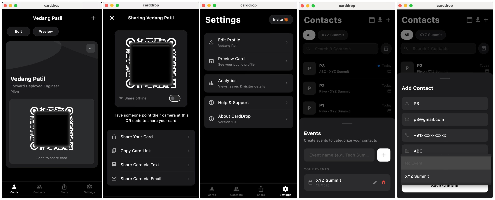

# CardDrop



## Why this exists

Conferences are a contact management nightmare. You share your info with dozens of people, then spend the evening manually typing names and numbers into your phone — and still have no clue who actually followed up on your side of the exchange.

The existing apps solve this, until you hit the paywall on feature #2. Paying a subscription to swap contact details felt absurd, so I built **CardDrop** — a free, open-source alternative you can host yourself.

## What it is

A digital business card you share via QR. Someone scans it, lands on your profile page, taps save, and their phone adds you as a contact. You see the scan happen in real time — who viewed, from where, and whether they actually saved you.

Works offline (the QR embeds a vCard directly). Tag contacts by event. Swipe right to delete, left to archive. Export everything to XLSX when the conference ends. No subscription — you bring your own Supabase and Netlify (both free tier, ~15 minute setup) and it's yours forever.

---

## What it does

**Your card, your way** — photo, bio, job title, company, 12 social platforms (LinkedIn, GitHub, Instagram, Twitter, and the rest). Customize the accent color.

**Share with a QR** — online mode shares a link to your Netlify profile; offline mode embeds the entire vCard inside the QR itself, so scanners work without internet. Also share via text, email, or copy link.

**Capture contacts** — people can save your info, and their info flows back into your Contacts tab. Tap to edit. Swipe right to delete, swipe left to archive (Gmail-style).

**Events** — tag contacts by event ("XYZ Summit", "Dev Conf 2026"). Filter, rename, delete. Export a specific event's contacts to XLSX for follow-ups.

**Analytics** — see total views, devices, and how many people actually saved you as a contact. Not just a vanity counter.

**Preview before you share** — see exactly what visitors see, in-app, without opening a browser.

---

## Project Structure

```
flutter_app/            # iOS/macOS app (Flutter)
  lib/
    models/             # LeadModel, EventModel, ProfileModel, etc.
    services/           # SupabaseService, ProfileService
    screens/            # Home, Contacts, Share, Settings, Analytics, etc.
    widgets/            # ProfileCardWidget
    theme/              # AppTheme, colors
    supabase_config.dart  # Your credentials here

netlify_profile/        # Public profile web page (React + Vite)
  src/
    components/         # ProfilePage.jsx
    supabase/           # client.js
  .env.example          # Credential template

supabase/migrations/    # SQL migrations
```

---

## Setup

### 1. Supabase

Create a project at [supabase.com](https://supabase.com), then run in SQL Editor:

```sql
CREATE TABLE profiles (
  id            TEXT PRIMARY KEY,
  display_name  TEXT DEFAULT '',
  job_title     TEXT DEFAULT '',
  company       TEXT DEFAULT '',
  bio           TEXT DEFAULT '',
  email         TEXT DEFAULT '',
  phone         TEXT DEFAULT '',
  website       TEXT DEFAULT '',
  photo_url     TEXT DEFAULT '',
  profile_color TEXT DEFAULT '#6C63FF',
  social_links  JSONB DEFAULT '[]'::jsonb,
  created_at    TIMESTAMPTZ DEFAULT NOW(),
  updated_at    TIMESTAMPTZ DEFAULT NOW()
);

CREATE TABLE leads (
  id               TEXT PRIMARY KEY,
  owner_profile_id TEXT NOT NULL,
  name             TEXT DEFAULT '',
  email            TEXT DEFAULT '',
  phone            TEXT DEFAULT '',
  organization     TEXT DEFAULT '',
  note             TEXT DEFAULT '',
  source           TEXT DEFAULT 'app',
  captured_at      TIMESTAMPTZ DEFAULT NOW(),
  is_new           BOOLEAN DEFAULT TRUE,
  event_id         TEXT DEFAULT '',
  archived         BOOLEAN DEFAULT FALSE
);

CREATE TABLE events (
  id               TEXT PRIMARY KEY,
  owner_profile_id TEXT NOT NULL,
  name             TEXT NOT NULL,
  created_at       TIMESTAMPTZ DEFAULT NOW()
);

CREATE TABLE profile_views (
  id             TEXT PRIMARY KEY DEFAULT gen_random_uuid(),
  profile_id     TEXT NOT NULL,
  source         TEXT DEFAULT 'qr',
  country        TEXT DEFAULT '',
  viewed_at      TIMESTAMPTZ DEFAULT NOW(),
  ip_address     TEXT DEFAULT '',
  device_name    TEXT DEFAULT '',
  user_agent     TEXT DEFAULT '',
  contact_saved  BOOLEAN DEFAULT FALSE
);

CREATE TABLE contacts (
  id               TEXT PRIMARY KEY,
  owner_profile_id TEXT NOT NULL,
  profile_id       TEXT,
  display_name     TEXT DEFAULT '',
  job_title        TEXT DEFAULT '',
  company          TEXT DEFAULT '',
  email            TEXT DEFAULT '',
  phone            TEXT DEFAULT '',
  website          TEXT DEFAULT '',
  photo_url        TEXT DEFAULT '',
  profile_color    TEXT DEFAULT '#6C63FF',
  saved_at         TIMESTAMPTZ DEFAULT NOW(),
  note             TEXT DEFAULT ''
);

ALTER TABLE profiles      ENABLE ROW LEVEL SECURITY;
ALTER TABLE leads         ENABLE ROW LEVEL SECURITY;
ALTER TABLE events        ENABLE ROW LEVEL SECURITY;
ALTER TABLE contacts      ENABLE ROW LEVEL SECURITY;
ALTER TABLE profile_views ENABLE ROW LEVEL SECURITY;

CREATE POLICY "open" ON profiles      FOR ALL USING (true) WITH CHECK (true);
CREATE POLICY "open" ON leads         FOR ALL USING (true) WITH CHECK (true);
CREATE POLICY "open" ON events        FOR ALL USING (true) WITH CHECK (true);
CREATE POLICY "open" ON contacts      FOR ALL USING (true) WITH CHECK (true);
CREATE POLICY "open" ON profile_views FOR ALL USING (true) WITH CHECK (true);
```

Create a storage bucket named `profile-photos` (public), then:

```sql
CREATE POLICY "public access" ON storage.objects
  FOR ALL USING (bucket_id = 'profile-photos')
  WITH CHECK (bucket_id = 'profile-photos');
```

### 2. Flutter App

Edit `flutter_app/lib/supabase_config.dart` with your credentials:

```dart
class SupabaseConfig {
  static const String url = 'https://YOUR_PROJECT.supabase.co';
  static const String anonKey = 'YOUR_ANON_KEY';
  static const String netlifyBaseUrl = 'https://YOUR_SITE.netlify.app';
}
```

Also update the Netlify URL in `flutter_app/lib/services/profile_service.dart`.

```bash
cd flutter_app
flutter pub get
flutter run
```

### 3. Netlify Profile Page

```bash
cd netlify_profile
cp .env.example .env
# Fill in your Supabase URL and anon key
npm install
npm run dev
```

Deploy to Netlify: build command `npm run build`, publish directory `dist`. Add the env vars from `.env` in Netlify dashboard.

---

## How it works

1. Fill out your profile in the app — photo, bio, socials.
2. Someone points their camera at your QR code.
3. They land on your Netlify-hosted profile page, tap "Save Contact", and your .vcf lands in their phone's contacts.
4. You see the view pop up in Analytics; if they shared their info back, they appear in Contacts.
5. Tag them with an event, export to XLSX when the conference is over, follow up.

---

## Stack

| | |
|---|---|
| App | Flutter 3 (iOS/macOS) |
| Database | Supabase (PostgreSQL) |
| Storage | Supabase Storage |
| Public page | React 18 + Vite |
| Hosting | Netlify |
| QR | qr_flutter |
| Charts | fl_chart |
| Export | excel (XLSX) |

All free tier. Bring your own keys.

---

## License

MIT
